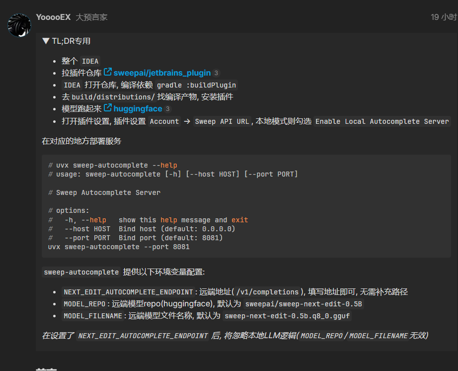
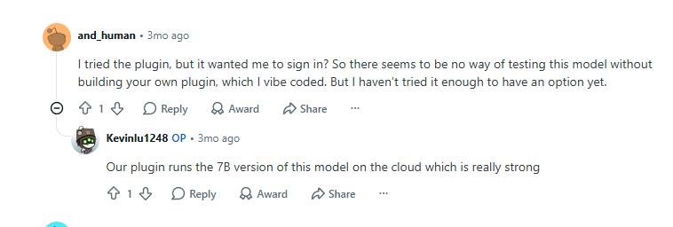
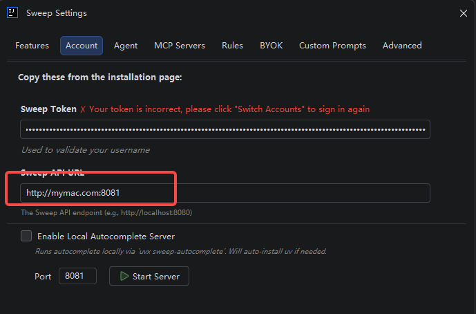
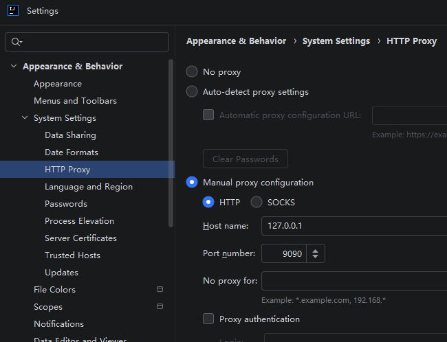
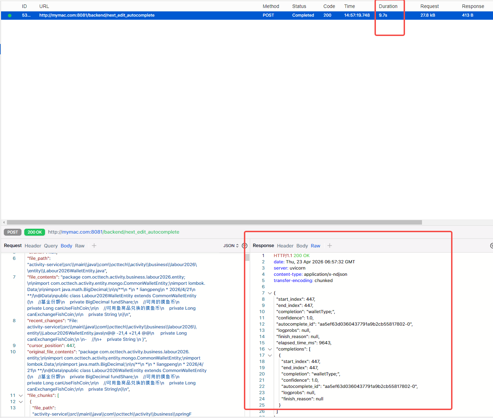

https://linux.do/t/topic/2029742



cmd 窗口

gradlew.bat --stop
gradlew.bat clean buildPlugin --no-configuration-cache --console=plain
gradlew.bat compileKotlin --no-daemon --no-configuration-cache --console=plain

https://www.reddit.com/r/LocalLLaMA/comments/1qkxuv1/sweep_openweights_15b_model_for_nextedit/





# 中间服务 必须在Linux (window bash 搞不定)
```
# uvx sweep-autocomplete --help
# usage: sweep-autocomplete [-h] [--host HOST] [--port PORT]

# Sweep Autocomplete Server

# options:
#   -h, --help   show this help message and exit
#   --host HOST  Bind host (default: 0.0.0.0)
#   --port PORT  Bind port (default: 8081)
uvx sweep-autocomplete --port 8081
```

sweep-autocomplete 提供以下环境变量配置:

NEXT_EDIT_AUTOCOMPLETE_ENDPOINT: 远端地址(/v1/completions), 填写地址即可, 无需补充路径
MODEL_REPO: 远端模型repo(huggingface), 默认为 sweepai/sweep-next-edit-0.5B
MODEL_FILENAME: 远端模型文件名称, 默认为 sweep-next-edit-0.5b.q8_0.gguf
若在本地部署, 根据环境选择合适的模型即可(MODEL_REPO/MODEL_FILENAME).

转发到其他服务时设置 NEXT_EDIT_AUTOCOMPLETE_ENDPOINT .

在设置了 NEXT_EDIT_AUTOCOMPLETE_ENDPOINT 后, 将忽略本地LLM逻辑(MODEL_REPO/MODEL_FILENAME无效)

插件配置
安装
打开要安装插件的 IDE, 在设置中找到插件页, 点击齿轮图标选择 Install Plugin from Disk 安装.

设置
打开插件设置, 插件设置 Account 页

根据 转发服务 部署的方式, 选择要填写的数据

远端部署: Sweep API URL 填写 URL



如果想要抓包 连接到本地proxyman代理

可以看到请求速度，我这是macbook 无显卡 9s 
uvx sweep-autocomplete 也能看到日志，9秒属于 完全不可实际使用的状态了，需要不错的显卡

```azure
2026-04-23 15:00:04.943 | DEBUG    | sweep_autocomplete.app:stream:102 - Next edit autocomplete took 7423.94ms for finally block:exit_reason=no_retrieved_code_block | reason=unknown | retrieval_chunks_count=-1 | retrieval_chunks_char_count=-1 | retrieval_chunks_line_count=-1 | file_chunks_count=-1 | file_chunks_char_count=-1 | file_chunks_line_count=-1
```



